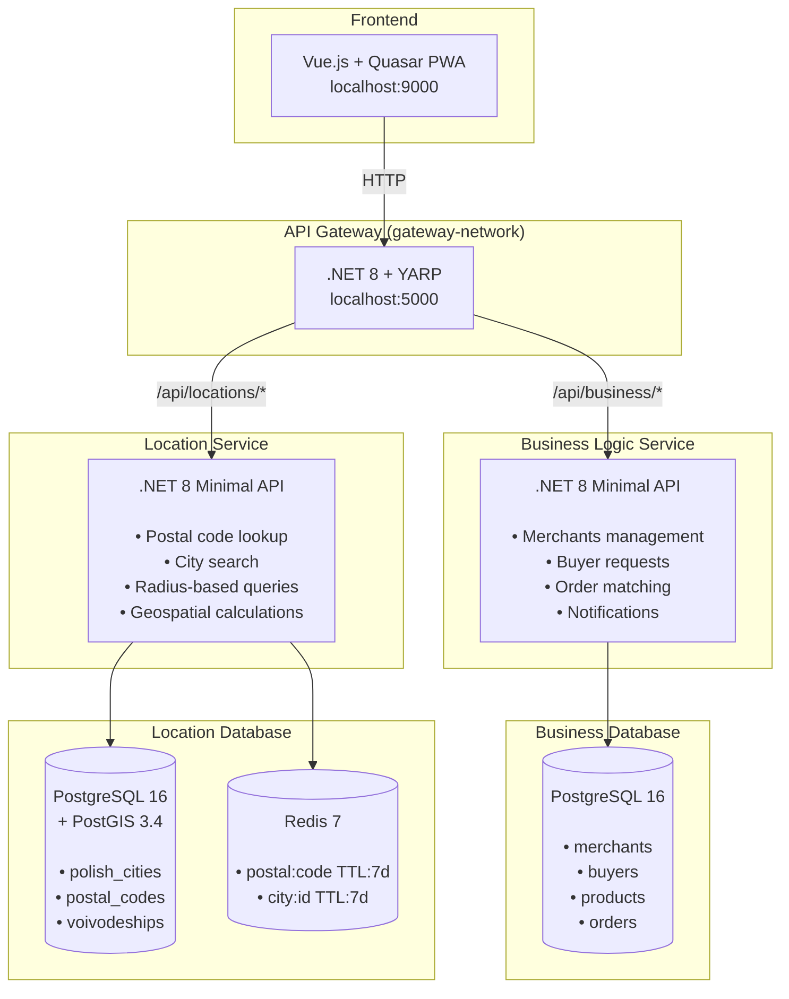
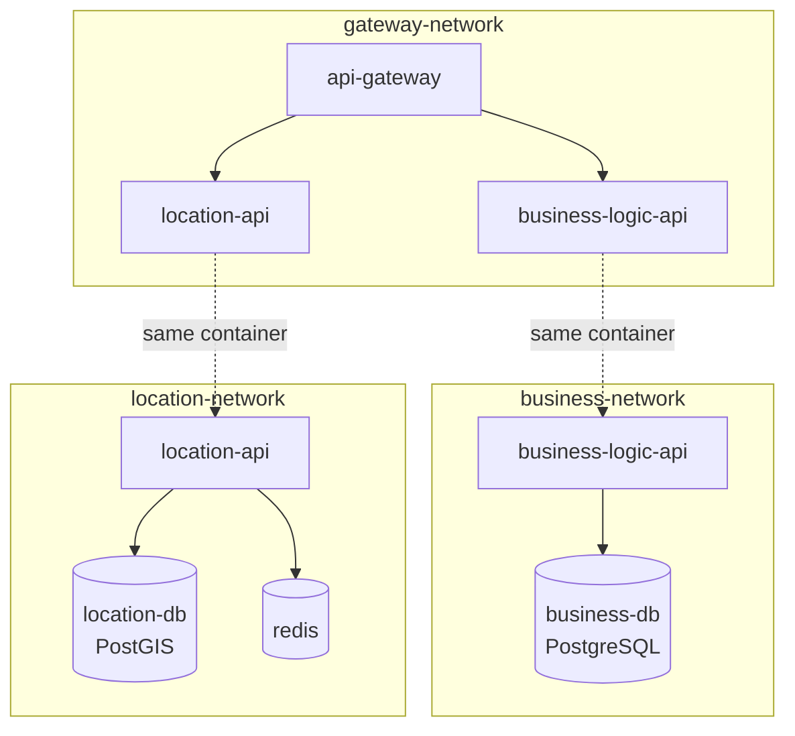
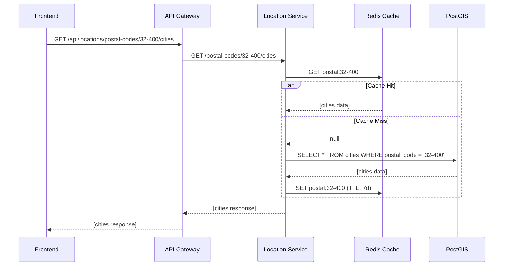
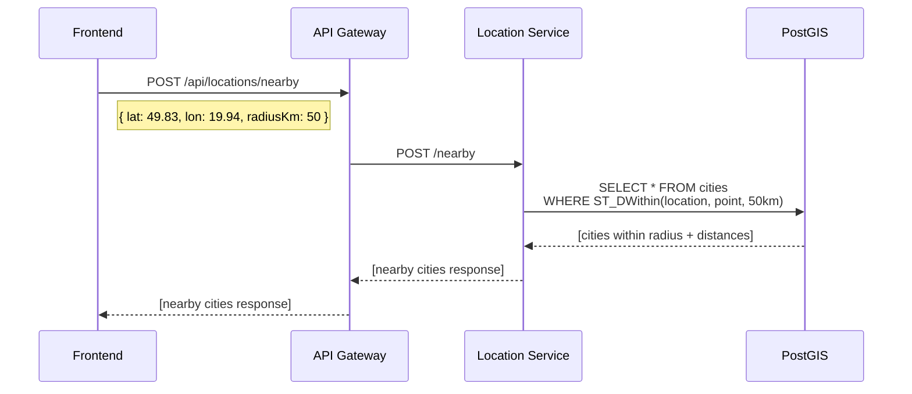

# Architecture Overview

## Description

This is a microservices-based MVP application for a location-aware marketplace platform built with .NET Core and Vue.js (Quasar). The system enables merchants to register their locations and buyers to search for products within a specified radius.

### Core Features

- **Location Service**: Handles Polish postal code lookups, city searches, and radius-based geospatial queries using PostGIS
- **Business Logic Service**: Manages merchants, buyers, products, and order matching logic
- **API Gateway**: Single entry point for the frontend, routes requests to appropriate microservices

### Communication Flow

1. Frontend communicates exclusively with the API Gateway
2. Gateway routes requests to appropriate microservices based on URL path
3. Each microservice has its own isolated database
4. Location Service uses Redis for caching postal code and city data (TTL: 7 days)

---

## Tech Stack

| Layer                      | Technology                                           |
| -------------------------- | ---------------------------------------------------- |
| **Frontend**               | Vue.js 3, Quasar Framework, TypeScript, PWA          |
| **API Gateway**            | .NET 8 Minimal API, YARP (Yet Another Reverse Proxy) |
| **Business Logic Service** | .NET 8 Minimal API, Entity Framework Core            |
| **Location Service**       | .NET 8 Minimal API, EF Core + NetTopologySuite       |
| **Business Database**      | PostgreSQL 16                                        |
| **Location Database**      | PostgreSQL 16 + PostGIS 3.4                          |
| **Cache**                  | Redis 7                                              |
| **Containerization**       | Docker, Docker Compose                               |
| **Location Data Source**   | TERYT (Polish government registry)                   |

---

## Architecture Diagram

## Docker Networks Diagram

## Sequence Diagram - Location Search Flow

## Sequence Diagram - Nearby Merchants Search

---
